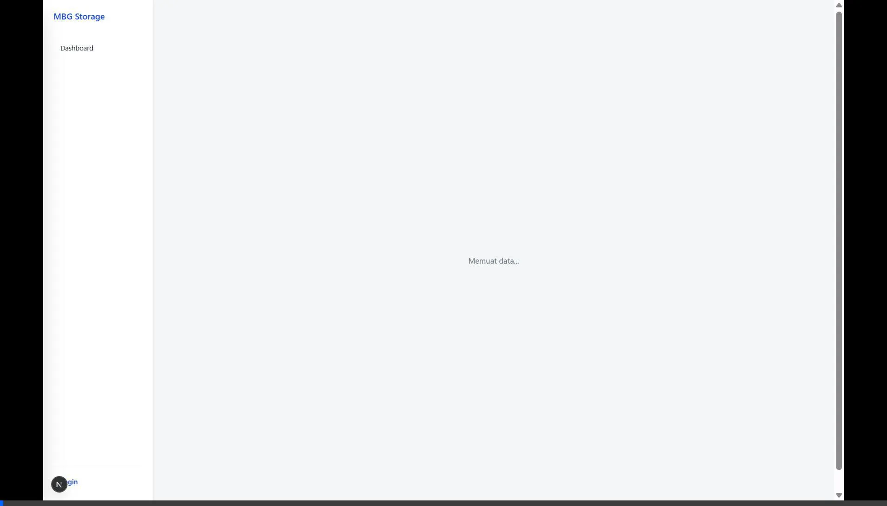
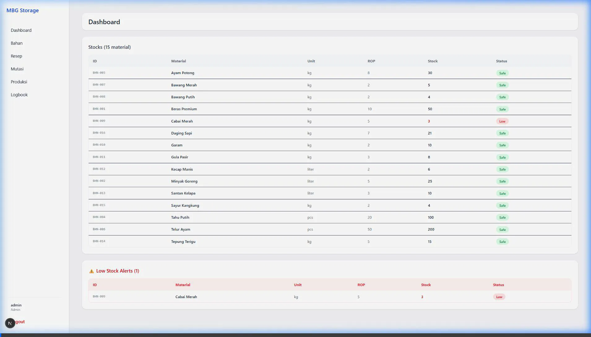
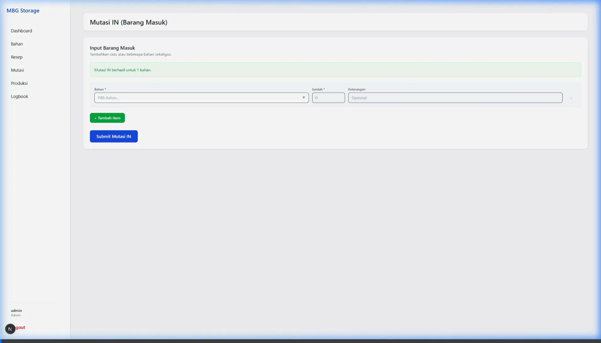
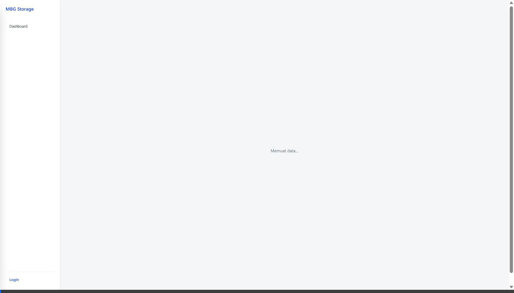
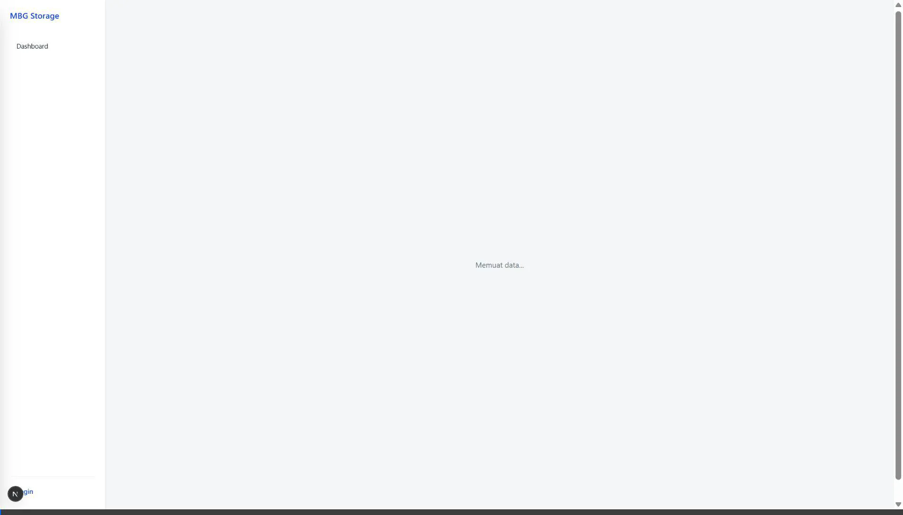
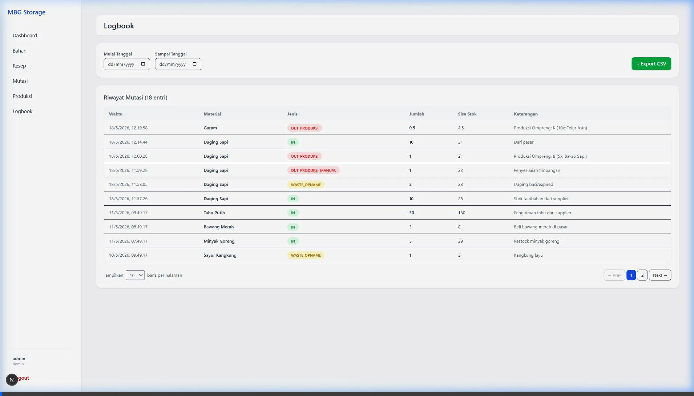
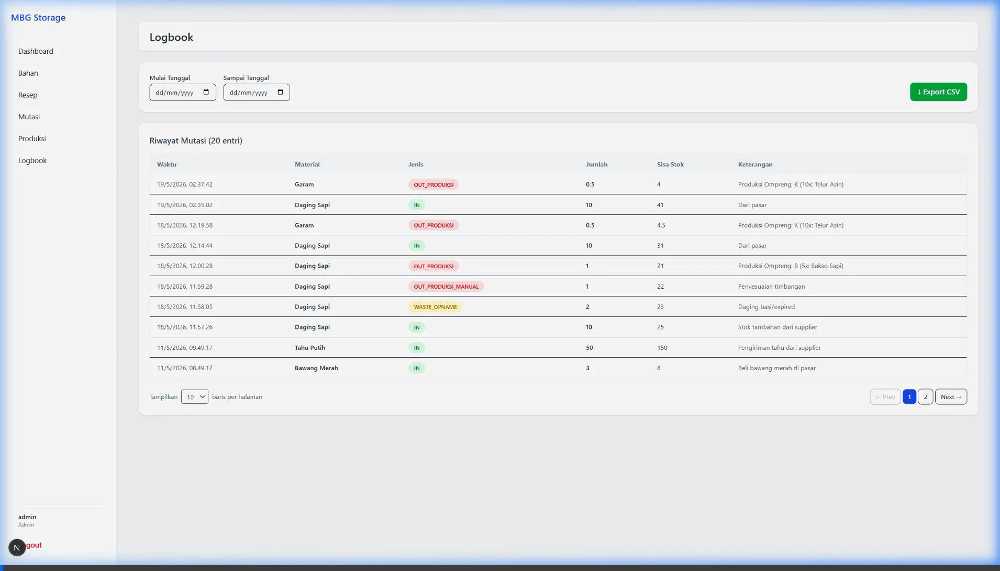

# Buku Panduan Penggunaan Aplikasi (Walkthrough)

Selamat datang! Panduan ini dibuat khusus agar Anda mudah memahami cara mencatat stok bahan makanan, takaran resep, dan produksi masakan harian.

Terdapat dua jenis akun yang bisa digunakan di aplikasi ini:
- **Akun Kepala Gudang (Username: `admin`)**: Punya akses penuh. Bisa menambah nama barang baru, membuat daftar resep, menghapus salah ketik, dan memantau stok.
- **Akun Staf Dapur (Username: `dapur`)**: Hanya bisa mencatat pemakaian bahan masakan harian dan melihat sisa stok. Tidak bisa mengubah/menghapus resep atau daftar bahan.

Mari kita pelajari satu per satu cara menggunakan fitur-fiturnya:

---

## 1. Cara Masuk (Login) & Membaca Halaman Utama

Halaman ini adalah pintu masuk dan papan pengumuman ringkas mengenai kondisi gudang Anda saat ini.

**Cara Pakai (Langkah demi langkah):**
1. Buka browser di komputer Anda lalu ketik alamat aplikasi (contoh: `http://localhost:3000`).
2. Di kotak isian **Username**, ketik nama pengguna (contoh: `admin` atau `dapur`).
3. Di kotak isian **Password**, ketik kata sandinya (contoh: `password123`).
4. Klik tombol biru **Masuk**.
5. Setelah berhasil, Anda langsung melihat **Halaman Utama (Dashboard)**. Di sini ada deretan kotak angka yang merangkum barang apa saja yang stoknya hampir habis dan harus segera dibeli.

---

## 2. Kelola Daftar Bahan Baku (Menu: Bahan)

Di sinilah Anda mendaftarkan nama-nama bahan mentah baru yang masuk ke gudang untuk pertama kalinya. Ingat, *hanya Kepala Gudang (Admin) yang bisa melihat kotak isian penambahan barang baru ini.*

**Cara Pakai (Langkah demi langkah):**
1. Klik menu bertuliskan **Bahan** di layar sebelah kiri.
2. Temukan kotak isian berjudul **Masukkan Item Baru**. Ketik nama bahan, misalnya: `Garam`.
3. Pilih ukuran satuannya di kotak **Satuan Dasar** (misalnya pilih `Kilogram (kg)`).
4. Di kotak **Batas ROP (Titik Aman Stok)**, masukkan angka batas aman. Misalnya ketik `2`. (Artinya: sistem akan memberi peringatan tulisan "Low" warna merah jika stok garam di gudang tinggal 2 kg ke bawah).
5. Di kotak **Stok Awal**, isi berapa kilogram barang yang ada secara fisik sekarang. (Misal ketik `5`).
6. Klik tombol **Submit** untuk menyimpan.
7. Geser layar ke bawah, dan Anda akan melihat barang "Garam" sudah tersimpan rapi di dalam tabel.

---

## 3. Menulis Resep Masakan & Takaran (Menu: Resep)

Halaman ini digunakan untuk mencatat porsi resep masakan. Tujuannya, agar saat Anda mengeklik "Mulai Masak", komputer langsung memotong stok bahan yang tepat tanpa perlu dihitung manual lagi.

**Cara Pakai (Langkah demi langkah):**
1. Klik menu **Resep** di layar sebelah kiri.
2. Di isian **Nama Menu / Resep**, ketik masakan yang ingin disetel (Misal: `Telur Asin`).
3. Di kotak **Pilih Bahan**, klik dan pilih nama bahan penyusunnya (Misal pilih: `Garam`).
4. Di pilihan **Tipe Porsi**, pilih apakah ini untuk porsi **BESAR** atau porsi **KECIL**.
5. Di isian **Jumlah Kebutuhan**, masukkan jumlah pemakaian. Karena satuan garam tadi kilogram, untuk memakai 50 gram, Anda mengetik `0.05`.
6. Klik **Submit**.
7. *Tips: Lakukan langkah yang sama jika menu ini menggunakan lebih dari 1 macam bahan (misal tambahkan bahan telur ayamnya di menu Telur Asin ini).*

---

## 4. Mencatat Barang Masuk, Rusak, & Penyesuaian (Menu: Mutasi)

Penting! Setiap ada barang yang masuk atau dibuang (bukan karena dimasak), catatlah di halaman ini supaya buku catatan tidak selisih dengan kenyataan fisik di rak gudang.

**Cara Pakai (Langkah demi langkah):**
1. Klik menu **Mutasi**.
2. Anda akan dihadapkan pada tiga pilihan besar:
   - 🟢 **Barang Masuk**: Klik ini bila Anda baru saja menerima barang dari supplier atau kurir pasar.
   - 🔴 **Barang Rusak**: Klik ini bila ada sayur busuk, barang kedaluwarsa, tumpah, atau cacat.
   - 🔵 **Koreksi Stok**: Klik ini apabila saat beres-beres gudang Anda menemukan bahwa stok fisik beda dengan angka di komputer dan butuh disamakan (ad-hoc).
3. (Contoh klik Barang Masuk): Pilih bahan `Daging Sapi (kg)` dari daftar dropdown.
4. Di kotak **Jumlah**, ketik berapa angka masuknya (misal: `10`).
5. Di kotak **Keterangan**, tulis rincian asal usul barang (misal: `Barang dari suplier pasar`).
6. Klik tombol di bagian paling bawah untuk menyimpan catatan tersebut. Stok barang otomatis diperbarui!

---

## 5. Memasak & Memotong Stok Otomatis (Menu: Produksi)

Ini adalah fitur utama yang akan dikerjakan tim dapur sehari-hari. Bagian ini untuk mencatat pesanan katering atau omprengan masakan secara masal.

**Cara Pakai (Langkah demi langkah):**
1. Klik menu **Produksi**.
2. Anda akan melihat dua kelompok bagian: Ompreng Besar dan Ompreng Kecil.
3. Misalnya pesanan hari ini Ompreng Kecil, ubah angka pada **Jumlah Ompreng** menjadi `10`.
4. Klik tombol kecil warna ungu/biru **+ Tambah Menu**.
5. Dari daftar dropdown yang muncul, pilih menu makanannya (misal: `Telur Asin`).
6. Klik tombol besar berwarna biru bertuliskan **Simulasi Produksi**.
7. Tunggu sesaat. Tabel hasil pengecekan akan keluar.
   - Jika tulisan bagian kanan berwarna **Hijau (Cukup)**: Stok gudang aman. Lanjut ke langkah 8.
   - Jika berwarna **Merah (Kurang)**: Persediaan bahan di gudang tidak cukup untuk membuat 10 porsi. Segera sampaikan ke mandor untuk belanja bahan mentah!
8. Jika semua hijau, Anda boleh mengeklik tombol besar berwarna hijau bertuliskan **Eksekusi Produksi**. Sistem akan langsung memotong seluruh stok di gudang dan kegiatan masak ini dianggap sah.

---

## 6. Buku Riwayat Pergerakan Stok (Menu: Logbook)

Ini adalah buku besar catatan histori. Gunanya persis seperti cetakan mutasi rekening di buku tabungan bank; mencatat kapan barang bertambah dan kapan berkurang dengan detail jam serta menitnya.

**Cara Pakai (Langkah demi langkah):**
1. Klik menu **Logbook**.
2. Layar akan memunculkan deretan data dari aktivitas terbaru ke terlama secara otomatis.
3. Selalu periksa nilai **"Sisa Stok Akhir"**. Kalau Anda lupa kemarin belanja jam berapa atau kebingungan kenapa stok garam tiba-tiba habis, telusurilah riwayat pemotongannya di tabel ini.
4. Karena halaman ini adalah bukti otentik, semua data yang tercatat di sini terkunci permanen dan **tidak bisa dihapus**.

---

## 7. Khusus Keamanan Tampilan Staf Dapur (Baca-Saja)

Demi keamanan, halaman Bahan dan Resep sengaja dibuat berbeda saat tim Dapur masuk menggunakan nama akunnya (`dapur`).

**Yang terjadi saat akun staf dapur dipakai:**
1. Staf tidak akan menemukan kotak "Tambah Item Baru" saat membuka halaman Bahan atau Resep. Layar bersifat *Read-Only* (hanya dibaca).
2. Staf juga tidak bisa menemukan tombol berwarna untuk "Edit" atau "Hapus" pada tabel resep.
3. Hak staf dapur **hanya** untuk mengklik dan mencatat di halaman operasional saja, yaitu halaman **Mutasi** (bila ada tumpah/busuk) dan halaman **Produksi** (bila mulai memasak katering).
4. Sesuai rekaman video di atas, jangan lupa untuk selalu mengeklik tombol **Logout** saat shift kerja di dapur selesai, agar tidak disalahgunakan orang asing.

